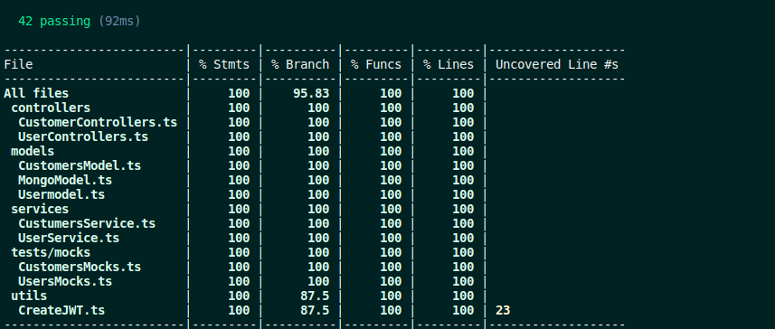

# Back-End

## 1 - Rotas do Usuário - User Routes

###  Login

| Método | Funcionalidade             | URL                              |
| ------ | -------------------------- | -------------------------------- |
| `POST` | Realiza o login do usuário | http://localhost:3001/login |

Nessa requisição `POST` é necessário informar o seguinte JSON:

```
{
  "username": "desafiosharenergy",
  "password": "sh@r3n3rgy"
}
```

Esta rota retorna o seguinte JSON:
```
{
	"token": 'token_ultra_secreto'
}
```

## 2 - Rotas de Customers - Customers routes

Todos as rotas abaixo necessitam de um token válido, que é gerado no login do usário, para poderem funcionar. Este token deve ser passado pelo `header` da requisição na chave `authorization`. 

### Register Custumers

| Método | Funcionalidade             | URL                                 |
| ------ | -------------------------- | ----------------------------------- |
| `POST` | Realiza o cadastro de clientes | http://localhost:3001/customers |

Nessa requisição `POST` é necessário informar o seguinte JSON:

```
{
  "_id": id do cliente,
  "name": nome do cliente,
  "email": email do cliente,
  "cpf": cpf do cliente,
  "phone": telefone do cliente,
  "address": endereço do cliente,
}

```
Esta requisição retorna o seguinte JSON 
```
{
  "_id": id do cliente,
  "name": nome do cliente,
  "email": email do cliente,
  "cpf": cpf do cliente,
  "phone": telefone do cliente,
  "address": endereço do cliente,
}
```

### Recuperação de clientes

| Método | Funcionalidade                                    | URL                                |
| ------ | ------------------------------------------------- | ---------------------------------- |
| `GET`  | Recupera as todos os clientes | http://localhost:3001/customers |

Nessa rota não é necesário o envio de um token válido atravéz do headers.

Nessa requisição `GET` é retornada as seguintes informações

```
[{
  "_id": id do cliente,
  "name": nome do cliente,
  "email": email do cliente,
  "cpf": cpf do cliente,
  "phone": telefone do cliente,
  "address": endereço do cliente,

}]
```

### Atualização de clientes

| Método | Funcionalidade                                    | URL                                |
| ------ | ------------------------------------------------- | ---------------------------------- |
| `PUT`  | Recupera as todos os clientes | http://localhost:3001/customers/:id |

É necesário o envio de um token válido atravéz do headers e um id pelo params.

Nessa rota é feita algumas validações de usuario: 

name: String, não vazio e maior que 3 caracteres,
email: String e formato email padrão,
cpf: String e formato cpf padrão,
phone: String e formato telefone padrão,
address: String e maior que 3 caracteres,


Nessa requisição `PUT` é necessário informar o seguinte JSON:

```
{
  "name"?: nome do cliente,
  "email"?: email do cliente,
  "cpf"?: cpf do cliente,
  "phone"?: telefone do cliente,
  "address"?: endereço do cliente,
}
```

Nessa requisição `PUT` é retornada as seguintes informações

```
{
  "_id": id do cliente,
  "name": nome do cliente,
  "email": email do cliente,
  "cpf": cpf do cliente,
  "phone": telefone do cliente,
  "address": endereço do cliente,

}
```

### Delete de clientes

| Método | Funcionalidade                                    | URL                                |
| ------ | ------------------------------------------------- | ---------------------------------- |
| `DELETE`  | Deleta um cliente especifico | http://localhost:3001/customers/:id |

É necesário o envio de um token válido atravéz do headers e um id pelo params.

Nessa requisição `DELETE` é retornada as seguintes informações

```
{
  "_id": id do cliente,
  "name": nome do cliente,
  "email": email do cliente,
  "cpf": cpf do cliente,
  "phone": telefone do cliente,
  "address": endereço do cliente,

}
```

### Encontrar um cliente específico

| Método | Funcionalidade                                    | URL                                |
| ------ | ------------------------------------------------- | ---------------------------------- |
| `POST`  | Encontrar um cliente pelo id | http://localhost:3001/customer |

É necesário o envio de um token válido atravéz do headers.

Nessa requisição `POST` é necessário informar o seguinte JSON:

```
{
  "id": id do cliente
}
```

Nessa requisição `POST` é retornada as seguintes informações

```
{
  "_id": id do cliente,
  "name": nome do cliente,
  "email": email do cliente,
  "cpf": cpf do cliente,
  "phone": telefone do cliente,
  "address": endereço do cliente,
}
```
## ⚙️ Executando os testes

Para essa aplicação back-end, foi feito testes unitarios, cobrindo 100% da aplicação.

`npm run test:dev` - Para rodar os testes unitários.
`npm run test:coverage` - Para rodar os testes junto com a cobertura da aplicação.

Testes back-end com 100% de cobertura.

<div align="center">
  
</div>
