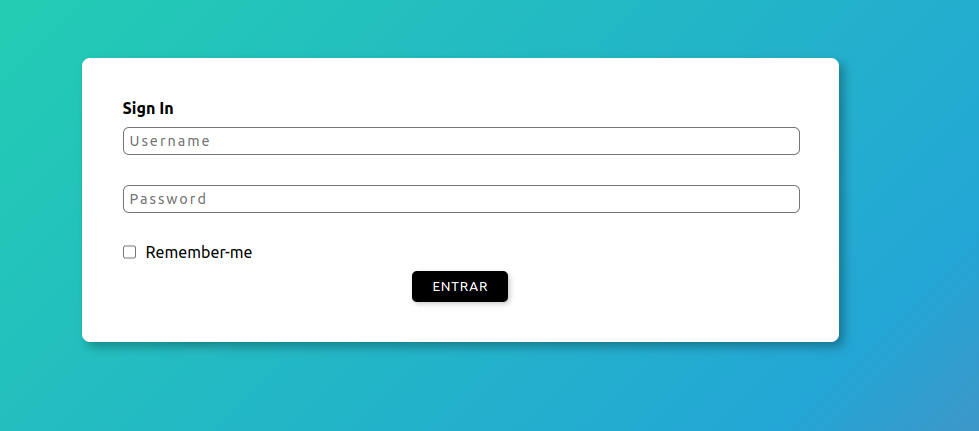
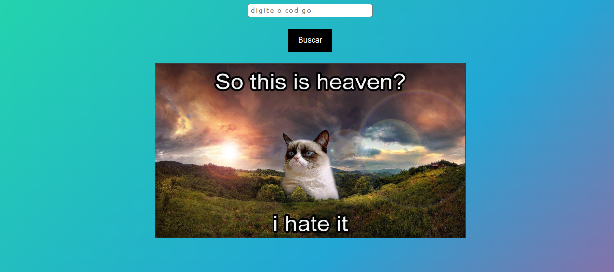
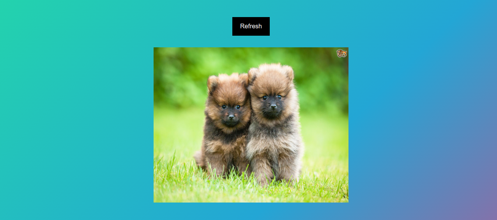
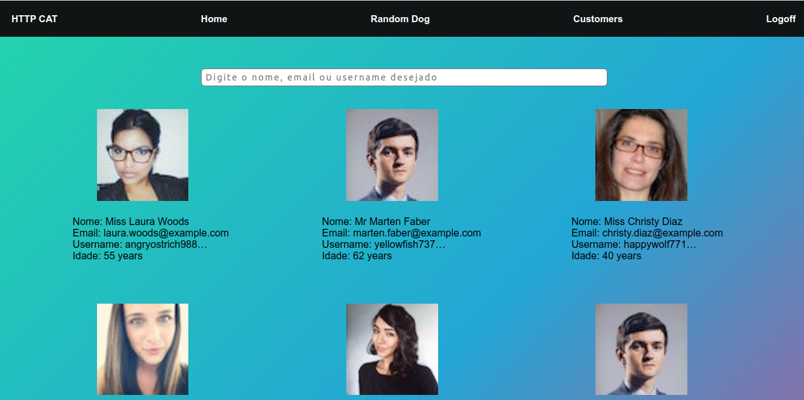
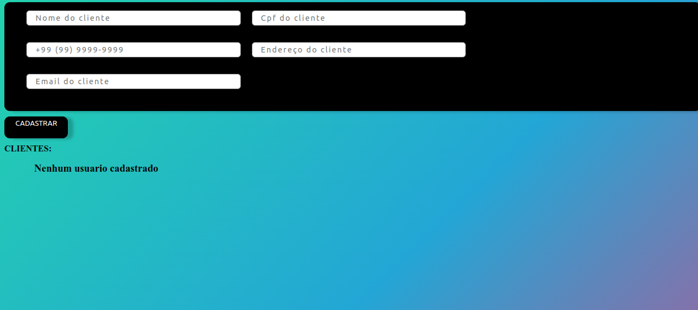

# Front End
	
Para ter acesso ao front end da aplicação, basta apenas acessar o endereço `http://localhost:3000/`.

## 1 - Login
Página simples, com um botão de longin e uma tag de Remember-me

Para realizar o login, basta clicar no botão `Login`. Caso queria não fazer mais login, basta clicar tambem na tag `Remember-me`

  

## 2 - Tela de Gatos

Nessa tela, usa-se a API `https://http.cat/{codigo}` com o codigo solicitado no input, junto com o botão, a API gera uma imagem com o codigo solicitado.

  

## 3 - Tela de Cachorros

Nessa tela, usa-se a API `https://random.dog/doggos/{codigo}`, o codigo gerado é aleatorio gerado pela própria aplicação.

  

## 4 - Tela de Users/Home

Nessa tela, usa-se a API `https://randomuser.me/api/?page=${page}&results=12&seed=abc`, nesse caso, API gerada é users aleatorios, para cada API gera 12 usuarios por paginas. O total de paginas dessa aplicação é 5.

  

## 5 - Tela de Clientes

Nessa tela, usa-se a API gerada no Backend, os campos possuem validação.

  

